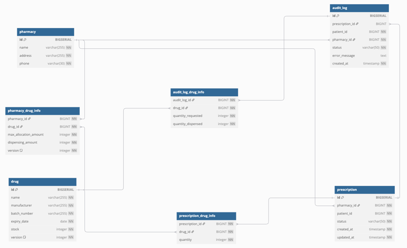

# 项目介绍

这是一个医药供应链和处方履行系统。管理了药物、药房、处方的基础信息和库存信息，以及患者处方的处理和各种处理的日志信息。


# 环境要求

Java 版本: JDK 21

构建工具：Maven

Spring Boot 版本：3.1.8


# 安装与运行说明

安装依赖并构建: 

`mvn clean install`

启动应用:

`mvn spring-boot:run`

# 本地构建数据库
运行docker-compose.yml文件在本地通过docker把postgreSql启动起来:

`docker-compose up`

# API 文档


## 药品接口

**创建药品:**

URL：`POST /drugs`

请求体:
```
{
  "name": "Paracetamol",
  "manufacturer": "ABC Pharma",
  "batchNumber": "B1234",
  "expiryDate": "2025-12-31",
  "stock": 100
}

```

响应状态：`200 OK`

响应体：
```
{
    "id": 101,
    "name": "Paracetamol",
    "manufacturer": "ABC Pharma",
    "batchNumber": "B1234",
    "expiryDate": "2025-12-31",
    "stock": 100
}
```

**修改药品库存/信息:**

URL：`PUT /drugs/{id}`

路径参数: `id`

请求体:
```
{
  "addedStock": 50
}

```

响应状态：`200 OK`

响应体：
```
{
    "id": 101,
    "name": "Paracetamol",
    "manufacturer": "ABC Pharma",
    "batchNumber": "B1234",
    "expiryDate": "2025-12-31",
    "stock": 100
}
```

## 药店接口

**获取药店及药品信息:**

URL：`GET /pharmacies`

响应状态：`200 OK`

响应体：
```
[
  {
    "pharmaciesId": 201,
    "name": "Central Pharmacy",
    "address": "123 Main St, Springfield",
    "phone": "+1 234 567 890",
    "drugInfoList": [
      {
        "id": 101,
        "name": "Paracetamol",
        "manufacturer": "ABC Pharma",
        "batchNumber": "B1234",
        "expiryDate": "2025-12-31",
        "maxAllocationAmount": 500,
        "dispensingAmount": 450
      },
      {
        "id": 102,
        "name": "Ibuprofen",
        "manufacturer": "XYZ Labs",
        "batchNumber": "C5678",
        "expiryDate": "2026-06-15",
        "maxAllocationAmount": 300,
        "dispensingAmount": 250
      }
    ]
  },
  {
    "pharmaciesId": 202,
    "name": "Downtown Pharmacy",
    "address": "456 Elm St, Springfield",
    "phone": "+1 234 678 901",
    "drugInfoList": [
      {
        "id": 103,
        "name": "Amoxicillin",
        "manufacturer": "PharmaCo",
        "batchNumber": "D2345",
        "expiryDate": "2025-11-20",
        "maxAllocationAmount": 200,
        "dispensingAmount": 180
      },
      {
        "id": 104,
        "name": "Aspirin",
        "manufacturer": "MedPlus",
        "batchNumber": "E6789",
        "expiryDate": "2027-05-10",
        "maxAllocationAmount": 1000,
        "dispensingAmount": 900
      }
    ]
  }
]


```

## 处方接口

**创建处方:**

URL：`POST /prescriptions`

请求体:
```
{
    "patientId": 1001,
    "drugId": 501,
    "quantity": 10
}
```

响应状态：`201 Created`

响应体：
```
{
  "prescriptionId": 1001,
  "prescriptionStatus": "CREATED"
}
```

**履行处方:**

URL：`PUT /prescriptions/{id}/status/fulfilled`

路径参数: `id`

响应状态：`200 OK`

响应体：
```
{
  "prescriptionId": 1001,
  "prescriptionStatus": "FULFILLED"
}
```

## 审计日志接口

**获取审计日志列表:**

URL：`GET /audit-logs`

请求参数: `patientId, pharmacyId, status `

响应状态：`200 OK`

响应体：
```
[
    {
        "id": 1,
        "prescriptionId": 1001,
        "patientId": 501,
        "pharmacyId": 201,
        "status": "APPROVED",
        "errorMessage": null,
        "createdAt": "2025-05-20T14:30:00",
        "drugs": [
            {
                "drugId": 101,
                "quantityRequested": 50,
                "quantityDispensed": 45
            },
            {
                "drugId": 102,
                "quantityRequested": 100,
                "quantityDispensed": 90
            }
        ]
    },
    {
        "id": 2,
        "prescriptionId": 1002,
        "patientId": 502,
        "pharmacyId": 202,
        "status": "REJECTED",
        "errorMessage": "Prescription not valid.",
        "createdAt": "2025-05-21T10:00:00",
        "drugs": [
            {
                "drugId": 103,
                "quantityRequested": 30,
                "quantityDispensed": 30
            }
        ]
    }
]
```

# 测试说明
**测试工具和框架:**

JUnit 5, Mockito, Spring Boot Test, H2

**测试执行:**
`mvn test`


**Controller层测试(接口测试)**

`AuditControllerTest`

`DrugControllerTest`

`PharmacyControllerTest`

`PrescriptionControllerTest`


**Repository层测试(数据持久化测试)**

`AuditLogRepositoryTest`

`DrugRepositoryTest`

`PharmacyDrugInfoRepositoryTest	`

`PharmacyRepositoryTest`

`PrescriptionRepositoryTest`


**Service层测试(核心业务逻辑测试)**

`AuditLogServiceTest`

`DrugServiceTest`

`PharmacyServiceTest`

`PrescriptionServiceTest`

`PrescriptionStatusServiceTest`

`StockUpdateServiceTest`


# Lint 使用说明

**代码规范检查(Checkstyle)**

项目集成了 checkstyle 插件，使用 src/main/resources/checkstyle.xml 规则文件

检查指令:

`mvn checkstyle:check`


# 数据库schema design
